# 🦌 raindeer.social — Complete Strategy, Architecture & AI Stack Blueprint
### Deep Research Edition — May 2026 | Version 2.0

## 1. 🚀 Overview

**raindeer.social** is an AI-first social media operating system designed to help SMBs, creators, and small agencies plan, create, execute, and optimize their social media presence without needing a full marketing team.

Unlike traditional tools that assist with isolated tasks (writing, scheduling, analytics), raindeer.social functions as a **complete system powered by multiple AI agents** that work together to automate end-to-end social media workflows.

> Core Idea: Replace fragmented tools and manual effort with an intelligent, autonomous system.

---

## Table of Contents

1. [Executive Summary](#1-executive-summary)
2. [Market Analysis — India & Global (2026 Data)](#2-market-analysis)
3. [Competitive Landscape Deep Dive](#3-competitive-landscape)
4. [Product Gap Analysis & Recommendations](#4-product-gap-analysis--recommendations)
5. [Recommended Agent Architecture](#5-recommended-agent-architecture)
6. [System Architecture — Technical Blueprint](#6-system-architecture--technical-blueprint)
7. [AI Stack — LLMs, RAG, Embeddings, Model Routing](#7-ai-stack)
8. [Agent Frameworks — Selection & Rationale](#8-agent-frameworks)
9. [MCP — Model Context Protocol Integration](#9-mcp-integration)
10. [Tool Calling & External Integrations](#10-tool-calling--external-integrations)
11. [Data Layer — Memory, Knowledge & State](#11-data-layer)
12. [Observability, Safety & Guardrails](#12-observability-safety--guardrails)
13. [Infrastructure & Deployment Strategy](#13-infrastructure--deployment)
14. [Revised Product Roadmap](#14-revised-product-roadmap)
15. [Business Model & Unit Economics](#15-business-model)
16. [Brand & UX Alignment](#16-brand--ux-alignment)
17. [Build vs. Buy Decision Matrix](#17-build-vs-buy-matrix)
18. [Risk Register](#18-risk-register)
19. [Appendix — Full Technology Reference Stack](#19-appendix)

---

## 1. Executive Summary

raindeer.social is positioned at the convergence of three compounding macro-trends:

- **Creator Economy**: India's creator economy is valued at **$15.03B in 2026**, growing to $61.87B by 2033 at a 22.4% CAGR — a massive, underserved market.
- **Social Media Management Software**: The global market hit **$39.14B in 2026**, projected to reach $164.52B by 2034 at 19.7% CAGR. India specifically is projected at **$1.27B in 2026**, growing to $1.16B by 2030 at a 28.4% CAGR — among the fastest growing markets globally.
- **Agentic AI Commoditisation**: The convergence of LangGraph v1.0 maturity, MCP's 10,000+ server ecosystem (97M monthly SDK downloads as of early 2026), and frontier model cost reduction makes autonomous multi-agent systems viable at SMB price points for the first time.

### Core Thesis — Validated and Sharpened

The product spec's insight — "system, not tool" — is directionally correct but architecturally incomplete. The version 2.0 architecture in this document elevates it from a concept to a genuinely defensible, production-grade system.

### Three Strategic Upgrades in v2.0

| Area | v1.0 (Current) | v2.0 (Recommended) |
|------|---------------|---------------------|
| **Architecture** | Sequential waterfall pipeline | Event-driven LangGraph state machine with parallel agent mesh |
| **Memory** | Static prompt templates | Adaptive RAG with Brand Knowledge Graph (hybrid dense + BM25 + GraphRAG) |
| **Costs** | Single LLM for all tasks | LiteLLM router — 60-70% cost reduction via tiered model selection |

### North Star Statement

> Build the Brand Knowledge Graph deep enough and the agent mesh smart enough that raindeer.social becomes structurally irreplaceable — not just a better scheduler, but the cognitive infrastructure for a brand's entire social presence.

### Implementation Snapshot — What Is Already Live

| Layer | Status | Notes |
|------|--------|------|
| Orchestration | Live | LangGraph state machine with Redis checkpointing and HITL branches |
| Content crew | Live | CrewAI inner crew wrapped as a LangGraph node |
| Brand memory | Live | Qdrant-backed Brand Knowledge Graph with Supabase metadata |
| Publishing | Live | Scheduler routes approved posts into platform-specific MCP publishers |
| Platform connectors | Live | LinkedIn, Meta (Instagram/Facebook), and X publish paths are implemented |
| Analytics | Live | Analytics API and MCP boundary exist; falls back safely when needed |
| UI surface | Live | Agents, Dashboard, Onboarding, Schedule, Review, and Social Studio are connected to the backend |
| Planned next | In progress | WhatsApp MCP, deeper GraphRAG hardening, stricter idempotency and retries |

---

## 2. Market Analysis

### 2.1 India — Primary Beachhead Market (2026 Data)

| Metric | 2026 Value | 2030/2033 Projection | CAGR |
|--------|-----------|---------------------|------|
| Social Media Mgmt Market | $1.27B | $1.16B (2030, GVR est.) | 28.4% |
| Creator Economy | $15.03B | $61.87B (2033) | 22.4% |
| Digital Ad Market | ~$18B | $20.46B (2029) | 10.1% |
| Social Media Users | 500M active identities | — | +5.23% YoY |
| Internet Users | 1B+ | — | +27.7% YoY (2024–2025) |
| Social Commerce Market | $29.27B | $143.86B (2030) | 37.5% |

**Structural Tailwinds — India-Specific:**

**SMB Digital Adoption Surge**: India's Ministry of Electronics and Information Technology reported in 2023 that 60% of SMEs used digital tools to boost online presence. With 63M+ SMBs and fewer than 2% using dedicated social media software, the addressable whitespace is enormous.

**Regional Language Explosion**: By 2026, 90% of new internet users in India prefer native-language content. Hindi, Tamil, Telugu, Kannada, and Bengali are the five highest-priority languages. raindeer.social's AI can generate multilingual posts at zero marginal cost — a structural advantage no human agency can match economically.

**Cost Arbitrage Story**: Social media management in India costs $300–$900/month for small businesses (agency rates). raindeer.social at ₹2,499–₹6,999/month delivers 3–10x ROI framing before any performance improvement is counted.

**Compliance Push**: India's Digital Personal Data Protection Act (DPDP Act, 2023) came into force in November 2025, driving SMBs to professionalize their digital presence and build documented content workflows — a pull factor for systematic tools.

**Short-Form Video Dominance**: YouTube India invested $100M for FY2025–2026 to accelerate creator growth. Instagram Reels and YouTube Shorts are the primary discovery channels for Indian DTC brands. Visual content generation is not optional — it's table stakes.

### 2.2 Global Opportunity

| Metric | 2025/2026 | 2030–2034 | CAGR |
|--------|---------|----------|------|
| Social Media Market | $234B (2026) | $389B (2030) | 13.5% |
| Social Media Mgmt Software | $39.14B (2026) | $164.52B (2034) | 19.7% |
| Social Media Mgmt Software | $22.43B (2024) | $74.23B (2031) | 18.65% |
| Creator Economy (Global) | $253B | $681B+ (2035) | 23.3% |

**Key Insight**: The global market is not winner-take-all at the SMB tier. Buffer's ARR is ~$20M serving simple scheduling. Sprout Social ($700M+ ARR) owns enterprise. The $29–$199/month AI-first execution segment has no sticky, dominant player. India is the fastest on-ramp to owning this globally.

### 2.3 Target Segment Matrix — Revised

| Segment | Pain Intensity | WTP | India Density | Priority |
|---------|--------------|-----|--------------|----------|
| Small social agencies (2–15 people) | Very High | High (₹7K–20K/mo) | High | **P0 — Day 1** |
| Founder-led DTC brands | Very High | Medium (₹2.5K–7K/mo) | Very High | **P0 — Day 1** |
| Content creators / coaches (100K–1M followers) | High | Medium (₹2K–5K/mo) | Very High | P1 — Month 4 |
| Regional retail / restaurants | High | Low (₹999–2.5K/mo) | Very High | P2 — Month 9 |
| Series A SaaS startups | Medium-High | High ($79–199/mo) | Medium | P2 — Year 2 |
| Enterprise marketing teams | Medium | Very High ($500+/mo) | Low | P3 — Year 3 |

**Recommendation**: Launch simultaneously with agencies (high ACV, viral within their networks) and founder-led DTC brands (high volume, organic social proof). Agencies provide margin; DTC brands provide case studies and virality.

---

## 3. Competitive Landscape

### 3.1 Direct Competitor Honest Assessment

| Tool | Strength | Critical Weakness | raindeer Opportunity |
|------|---------|-----------------|---------------------|
| **Buffer** | Simplicity, pricing | No AI, no strategy, no learning loop | Full replacement at 3x capability, similar price |
| **Hootsuite** | Breadth, integrations | $199+/mo, complexity, legacy UX | Premium tier displacement |
| **Sprout Social** | Analytics, CRM integration | $399+/seat, no SMB fit | Irrelevant competitive segment |
| **Ocoya** | AI + scheduling combo | Shallow AI, no memory, no agent architecture | Closest peer — differentiate on agent depth |
| **Lately AI** | Content repurposing ML | Single-use case, $149+/mo | Augment rather than replace |
| **Vista Social** | Value pricing, UI quality | Superficial AI, no strategy layer | Similar positioning — must win on intelligence depth |
| **Metricool** | Analytics + scheduling | Weak AI, no autonomous execution | Analytics layer only |
| **SocialPilot** | SMB/agency focus, India-origin | Acquired ($50M, 2025), no AI roadmap | Direct acquisition proof of market size |
| **Taplio/Typefully** | LinkedIn-specific excellence | Platform locked | Expand to multi-platform |
| **Canva** | Design-first, massive user base | Adding AI + scheduling — growing threat | Must establish brand intelligence moat first |

> **Critical Signal**: SocialPilot (Indian SMM platform) was acquired for $50M+ in 2025. This validates the market and raises the urgency of establishing a defensible position.

### 3.2 Emerging 2026 Threats

| Threat | Timeline | Risk Level | Mitigation |
|--------|---------|----------|-----------|
| Canva AI (scheduling + copy generation) | 6–12 months | High | Brand Knowledge Graph depth — Canva has no brand memory architecture |
| HubSpot Breeze (AI copilot) | Now | Medium | SMB pricing moat — HubSpot starts at $800/mo |
| Meta/LinkedIn native AI post generation | Now | Medium | Cross-platform intelligence — native tools are silo'd |
| OpenAI's operator-class agents | 12–18 months | High | Deep brand specialisation vs. general-purpose agents |
| Google Workspace AI agents | 12–18 months | Medium | Workflow integration vs. social specialisation |

### 3.3 True Differentiation — Engineering-Backed Moats

The "system, not tool" positioning must be backed by specific engineering choices that are hard to replicate:

1. **Brand Knowledge Graph that compounds**: A persistent Qdrant vector store with GraphRAG layer that grows smarter with every post published, every engagement received, and every human correction made. Competitors use static prompts.

2. **Cross-platform optimisation intelligence**: Most tools optimise per platform in isolation. raindeer.social learns cross-platform patterns — what works on Instagram Reels directly informs LinkedIn carousel strategy for the same brand.

3. **True autonomy loop without babysitting**: Strategy → Content → Visual → Publish → Listen → Analyse → Adapt — without manual re-triggering at each step. The loop runs continuously.

4. **Model routing for cost-efficient quality**: Using LiteLLM to route tasks to the cheapest capable model — delivering Claude-quality brand voice at Gemini Flash prices for bulk tasks. This enables sustainable unit economics at SMB price points.

5. **Multi-tenant agency architecture from Day 1**: Built for agencies managing multiple clients, not retrofitted later. Each client has an isolated Brand Knowledge Graph, credentials, and analytics silo.

---

## 4. Product Gap Analysis & Recommendations

### 4.1 What the Current Spec Gets Right ✅

- Agent architecture concept is directionally correct and future-proof.
- Multi-platform, multi-format content is the right scope (not LinkedIn-only or Instagram-only).
- Human-in-the-loop review preserves user trust during the AI calibration phase.
- Three-phase roadmap (Social OS → Growth Intelligence → Marketing OS) is strategically logical.
- "Calm intelligence" brand aesthetic is differentiated from chaotic AI tool aesthetics.

### 4.2 Critical Gaps — What Must Change

#### Gap 1: Agent Architecture is Too Linear (CRITICAL)

**Problem**: The current spec describes a sequential pipeline: Planner → Content → Brand → Scheduling → Optimisation. Real social workflows are parallel and event-driven. A viral post at 2am requires instant calendar rescheduling. A trending topic requires the Planner to interrupt the Content agent mid-flight. A crisis comment spike must pause all scheduled content.

**Fix**: Replace the sequential pipeline with an **event-driven LangGraph StateGraph** where agents react to state changes asynchronously and can run in parallel where safe to do so.

---

#### Gap 2: No Multimodal Visual Content Layer (CRITICAL)

**Problem**: The current spec addresses text captions only. Instagram Reels, LinkedIn carousels, and visual posts drive 3–10x more engagement than text-only. A social media OS without visual generation is structurally incomplete in 2026.

**Fix**: Add a **Visual Content Agent** with three sub-components:
- Image Prompt Engineer (translates briefs into optimised generation prompts)
- Image Generator (Flux.1 Pro API primary, DALL-E 3 fallback)
- Template Renderer (applies brand colour system to generated assets using Bannerbear or custom renderer API)
- Carousel Assembler (builds multi-slide carousels from structured content outlines)

---

#### Gap 3: No Real-Time Trend Intelligence (HIGH)

**Problem**: The spec generates strategy from brand context alone. Social media wins or loses based on timing — trending topics, algorithm shifts, viral moments. A static content calendar is blind to opportunity.

**Fix**: Add a **Trend Intelligence Agent** that monitors Google Trends, X/Twitter trends, Reddit niche subreddits, and optionally BuzzSumo — filtering for brand-relevant signals every 4 hours, with urgent trends triggering immediate notification.

---

#### Gap 4: Brand Intelligence is Prompt Engineering, Not a System (HIGH)

**Problem**: The spec says "maintains brand voice memory" — but this implies a system prompt. A single system prompt cannot encode a brand's evolving voice, platform-specific tone variations, audience preferences by content type, and historical performance context.

**Fix**: Build a **Brand Knowledge Graph** using Qdrant vector database + structured PostgreSQL metadata + Microsoft GraphRAG for entity relationships. This is true brand memory — queryable, updatable in real time, and growing with every post.

---

#### Gap 5: No A/B Testing / Experimentation Framework (MEDIUM)

**Problem**: "Adaptive learning" without statistical experimentation is marketing folklore. You cannot know which hook style works without controlled tests.

**Fix**: Add an **Experiment Agent** that creates variant posts (e.g., two different hook formulations for the same brief), schedules both to similar audience segments, tracks statistical significance, and feeds confirmed winners into the Brand Knowledge Graph.

---

#### Gap 6: No Engagement Webhook Architecture (MEDIUM)

**Problem**: The spec treats scheduling as a cron job. Platform APIs (Meta Graph API, LinkedIn API, X API v2) emit real-time webhooks for engagement events — comments, reactions, shares, DM bursts, follower changes. Ignoring these is a missed signal and a missed crisis-detection opportunity.

**Fix**: Build an **Engagement Listener** that ingests platform webhooks, feeds engagement signals into the Brand Knowledge Graph in real time, and triggers the Optimisation Agent with fresh context after each high-engagement post.

---

#### Gap 7: No WhatsApp / Community Channel Integration (INDIA-SPECIFIC, MEDIUM)

**Problem**: India's digital marketing stack is incomplete without WhatsApp. WhatsApp Business has 200M+ users in India. DTC brands use it for community building, product drops, and customer support — all of which generate brand-relevant content signals.

**Fix**: Add WhatsApp Business API as a P1 integration for the India market. The Engagement Listener should ingest WhatsApp community activity as brand signal input.

---

#### Gap 8: Onboarding Flow is Underspecified (HIGH — ACTIVATION CRITICAL)

**Problem**: The spec mentions "brand onboarding" but doesn't describe it as the product's defining first experience. Activation in AI-first products is won or lost in the first 3 minutes.

**Fix**: The onboarding flow must be the most impressive 5 minutes in the product:
1. User pastes website URL or connects Instagram/LinkedIn.
2. Brand Intelligence Agent scrapes, analyses, and generates a brand profile in under 30 seconds.
3. User sees their brand voice map, content pillars, and first 7 content ideas before completing signup.
4. First content calendar is generated within 3 minutes of account creation.
5. First post is ready to review in 5 minutes.

This "magic moment" drives activation, referrals, and is architecturally impossible for simple tools to replicate.

---

## 5. Recommended Agent Architecture

### 5.1 Architecture Philosophy

The recommended architecture is a **Hierarchical Reactive Multi-Agent System** with three tiers. The key design insight: agents don't just execute tasks sequentially — they **react to state changes** in the shared state graph, enabling true autonomy.

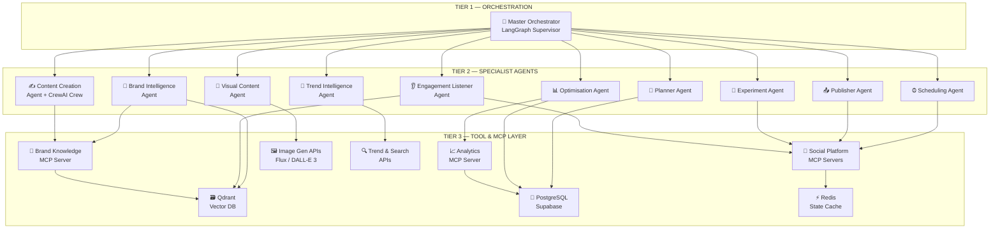

### 5.2 Agent Workflow — End-to-End State Machine

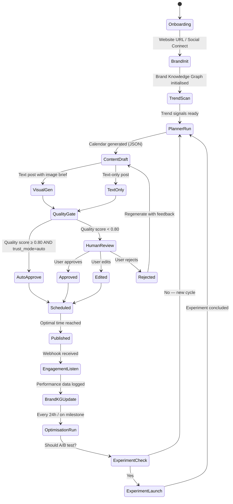

### 5.3 Agent Communication — LangGraph Shared State Protocol

All agents communicate via a **shared state object** in LangGraph. No point-to-point messaging. This ensures full auditability, rollback capability, parallelism, and native human-in-the-loop support.

```python
# raindeer_state.py — Shared State Schema (No hardcoded values)
from typing import TypedDict, Optional, List, Annotated
from dataclasses import dataclass
import operator

@dataclass
class BrandContext:
    tenant_id: str
    voice_attributes: dict        # tone, style, personality axes
    content_pillars: List[str]    # educational, promotional, storytelling, etc.
    audience_profiles: dict       # platform-specific audience data
    platform_configs: dict        # per-platform tone and format rules
    top_performing_patterns: List[dict]  # retrieved from Brand KG
    mistakes_to_avoid: List[str]  # learned from poor performers

@dataclass
class TrendSignal:
    keyword: str
    platform: str
    velocity_score: float         # rate of trend acceleration
    relevance_score: float        # cosine similarity to brand category
    suggested_angle: str          # AI-generated content angle
    expires_at: str               # when this signal goes stale

@dataclass
class Post:
    id: str
    tenant_id: str
    platform: str
    content: str
    visual_asset_url: Optional[str]
    status: str                   # planned|drafting|drafted|reviewing|scheduled|published|failed|rejected
    quality_score: float          # Brand Intelligence quality gate score
    experiment_id: Optional[str]  # Links to A/B test if applicable
    scheduled_at: Optional[str]
    flags: List[str]              # Safety flags from content pipeline

class RaindeerState(TypedDict):
    tenant_id: str
    workflow_id: str
    workflow_type: str            # onboarding|content_cycle|trend_reactive|experiment
    brand_context: BrandContext
    content_calendar: dict
    trend_signals: Annotated[List[TrendSignal], operator.add]  # append-only
    content_briefs: List[dict]
    active_brief: Optional[dict]
    posts_drafting: List[Post]
    posts_approved: List[Post]
    posts_failed: List[Post]
    posts_scheduled: Annotated[List[Post], operator.add]
    published_posts: Annotated[List[Post], operator.add]
    active_experiments: List[dict]
    performance_data: dict
    budget: dict                  # max_tokens, used_tokens, max_cost_usd, used_cost_usd, api_calls
    retry_counts: dict
    error_log: Annotated[List[dict], operator.add]
    latest_agent_event: Optional[dict]
    is_onboarding: bool
    brand_kg_initialised: bool
    cycle_complete: bool
    workflow_mode: str            # automated|review|copilot|batch|continuous
```

### 5.4 Inner Content Crew (CrewAI within LangGraph)

The Content Creation Agent is itself a **CrewAI crew** invoked as a single LangGraph node. This gives role-based specialisation with clear quality gates:

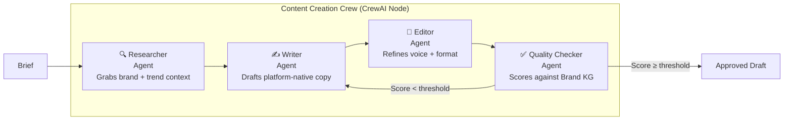

---

## 6. System Architecture — Technical Blueprint

### 6.1 High-Level System Architecture

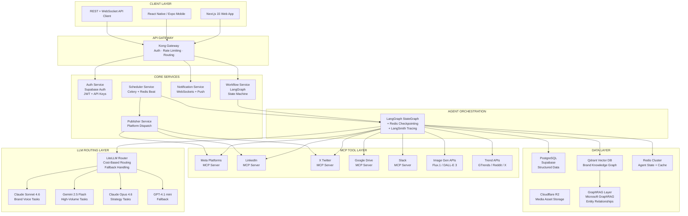

### 6.2 Request Flow — Content Generation

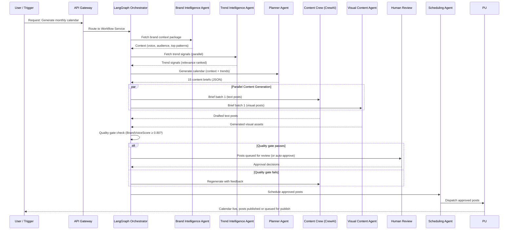

### 6.3 Multi-Tenant Architecture

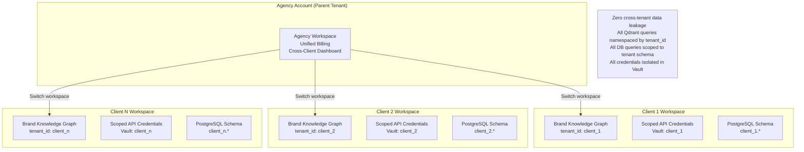

### 6.4 Execution Modes

| Mode | Description | Use Case | Cost Profile |
|------|-------------|----------|-------------|
| **Review** | Every post requires human approval before scheduling | Default — all new accounts | Standard |
| **Automated** | AI quality gate replaces human (≥0.85 score = auto-publish) | High-trust accounts, post-calibration | Standard |
| **Co-pilot** | User initiates, AI assists specific tasks | Power users who want control | Standard |
| **Batch** | Overnight bulk processing (full month's content) | Cost optimisation | 50% cost reduction via Anthropic/OpenAI Batch APIs |

---

## 7. AI Stack

### 7.1 LLM Strategy — Tiered Model Routing

The single largest cost mistake in AI product development is using one model for every task. raindeer.social implements **intelligent model routing** via LiteLLM, mapping each task type to the optimal model.

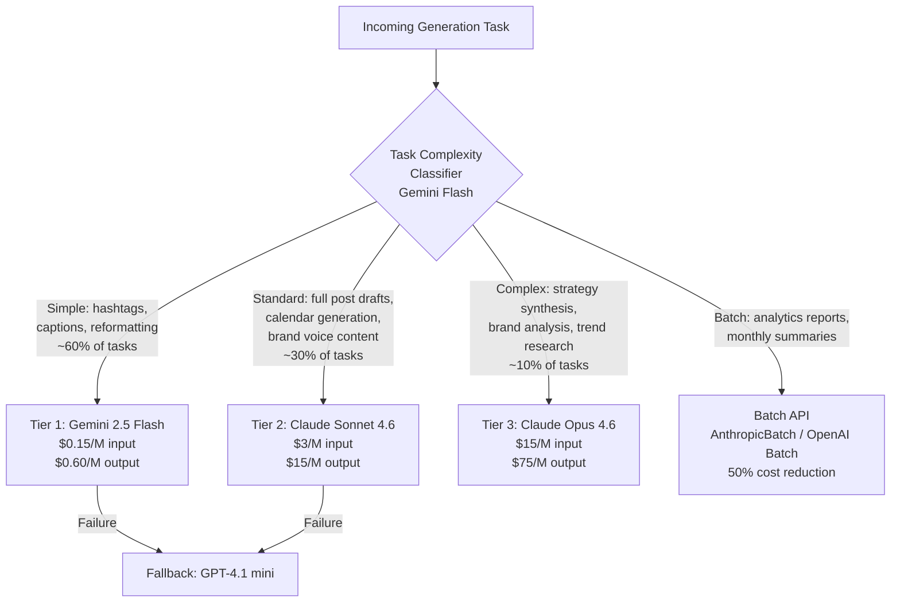

```python
# llm_router.py — LiteLLM Router Configuration
# All credentials loaded from environment variables / Vault

import os
from litellm import Router

def build_router() -> Router:
    return Router(
        model_list=[
            {
                "model_name": "tier1-fast",
                "litellm_params": {
                    "model": "gemini/gemini-2.5-flash",
                    "api_key": os.environ["GOOGLE_API_KEY"],
                    "max_retries": 2,
                }
            },
            {
                "model_name": "tier2-standard",
                "litellm_params": {
                    "model": "anthropic/claude-sonnet-4-6",
                    "api_key": os.environ["ANTHROPIC_API_KEY"],
                    "max_retries": 2,
                }
            },
            {
                "model_name": "tier3-complex",
                "litellm_params": {
                    "model": "anthropic/claude-opus-4-6",
                    "api_key": os.environ["ANTHROPIC_API_KEY"],
                    "max_retries": 1,
                }
            },
            {
                "model_name": "fallback",
                "litellm_params": {
                    "model": "openai/gpt-4.1-mini",
                    "api_key": os.environ["OPENAI_API_KEY"],
                    "max_retries": 3,
                }
            },
        ],
        fallbacks=[
            {"tier2-standard": ["fallback"]},
            {"tier1-fast": ["fallback"]},
        ],
        routing_strategy="cost-based",
        enable_pre_call_checks=True,
        num_retries=3,
        retry_after=5,
        allowed_fails=2,
        cooldown_time=60,
    )

# Task type → model tier mapping
TASK_MODEL_MAP = {
    "hashtag_generation": "tier1-fast",
    "caption_variation": "tier1-fast",
    "platform_reformatting": "tier1-fast",
    "scheduling_description": "tier1-fast",
    "full_post_draft": "tier2-standard",
    "calendar_generation": "tier2-standard",
    "hook_writing": "tier2-standard",
    "brand_voice_content": "tier2-standard",
    "strategy_synthesis": "tier3-complex",
    "brand_analysis": "tier3-complex",
    "trend_research": "tier3-complex",
    "competitor_analysis": "tier3-complex",
}
```

**Why Claude for Brand Voice Tasks**: Claude Sonnet 4.6 leads benchmarks for natural prose quality, precise instruction-following on nuanced creative tasks, and long-context coherence — the three capabilities most critical for brand-voice-accurate content generation across platforms.

**Why Gemini 2.5 Flash for Volume**: At $0.15/M input tokens, Gemini 2.5 Flash provides near-frontier quality at commodity prices. Ideal for hashtag generation, caption variations, and platform reformatting that make up 60% of all generation calls.

**Estimated Cost Savings from Routing + Caching**: 60–70% reduction vs. single-model approach.

### 7.2 RAG Architecture — Adaptive Brand Knowledge Graph

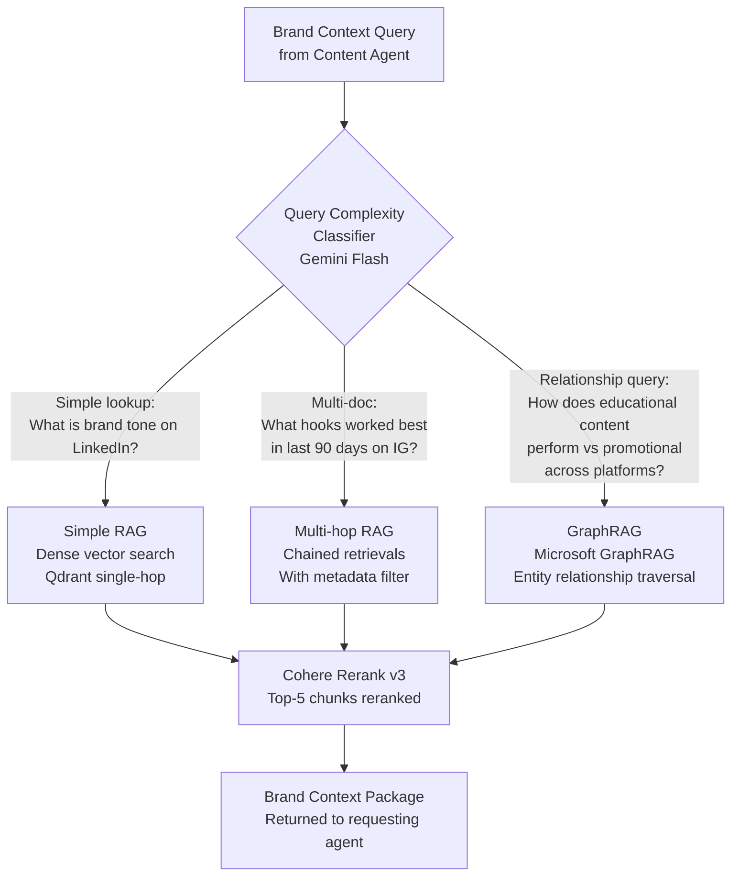

#### Why RAG Over Fine-Tuning

Fine-tuning is expensive, slow to update, and cannot incorporate real-time performance feedback. RAG is correct because:
- Brand voice evolves continuously — updates take seconds (new embeddings), not hours (retraining).
- Past post performance must be queryable with metadata filters (date, platform, content type, score).
- Audience insights change with every campaign cycle.
- The Brand KG grows richer with every post published — creating compounding defensibility.

#### Brand Knowledge Graph Schema (Qdrant)

```python
# brand_kg_schema.py — Qdrant document schema

BRAND_KG_DOCUMENT_SCHEMA = {
    "id": "uuid-v4",
    "vector": "float[1536]",     # OpenAI text-embedding-3-large
    "payload": {
        "tenant_id": "str",       # Required: namespace isolation
        "doc_type": "enum[post|brand_guideline|audience_insight|performance_record|trend_signal]",
        "platform": "enum[instagram|linkedin|x|facebook|youtube|all]",
        "content_type": "enum[educational|promotional|storytelling|trending|ug_inspired]",
        "content_format": "enum[text|carousel|reel|story|thread|video]",
        "performance_score": "float[0,1]",     # normalised engagement score
        "published_at": "datetime",
        "content_tags": "str[]",               # product_launch, founder_story, etc.
        "raw_content": "str",
        "language": "str",                     # en, hi, ta, bn, te, etc.
        "metrics": {
            "likes": "int",
            "shares": "int",
            "comments": "int",
            "saves": "int",
            "reach": "int",
            "impressions": "int",
            "click_through_rate": "float"
        },
        "experiment_id": "str|null",           # Links to A/B test
        "human_edited": "bool",                # Was this post edited by human?
        "edit_delta": "str|null"               # What changed (if edited)
    }
}
```

#### Embedding Strategy

| Use Case | Model | Rationale |
|----------|-------|-----------|
| Primary production | OpenAI text-embedding-3-large (1536d) | Best semantic accuracy for English |
| Hindi / multilingual | Cohere embed-v4.0 multilingual | 100+ languages, better regional coverage |
| Cost reduction at scale (10K+ accounts) | Cohere embed-v4.0 | 10B tokens/$ vs text-embedding-3-large |

#### Prompt Caching Strategy

Claude and Gemini APIs both support prompt caching. Implementation:
- Brand context packages: Cache for 6 hours (refreshed when new performance data arrives).
- Platform posting guidelines: Cache indefinitely (rarely changes).
- Monthly content strategy frameworks: Cache per planning cycle.

**Estimated savings from prompt caching**: 40–55% on brand-context-heavy generation tasks.

---

## 8. Agent Frameworks

### 8.1 Framework Comparison — 2026 Production Reality

| Framework | Architecture | Production Readiness | Token Efficiency | HITL Support | MCP Native |
|-----------|-------------|---------------------|----------------|-------------|-----------|
| **LangGraph** | Directed graph, stateful | ⭐⭐⭐⭐⭐ (v1.0) | ⭐⭐⭐⭐⭐ (best) | ⭐⭐⭐⭐⭐ (native) | Community |
| **CrewAI** | Role-based teams | ⭐⭐⭐⭐ | ⭐⭐⭐ (18% overhead) | ⭐⭐⭐ (wrappers) | A2A support |
| **AutoGen / AG2** | Conversational | ⭐⭐⭐ (improving) | ⭐⭐ (most overhead) | ⭐⭐⭐⭐ (proxy pattern) | Limited |
| **OpenAI Agents SDK** | Explicit handoffs | ⭐⭐⭐⭐ | ⭐⭐⭐⭐ | ⭐⭐⭐ | None (OpenAI lock-in) |
| **Google ADK** | Hierarchical tree | ⭐⭐⭐⭐ | ⭐⭐⭐⭐ | ⭐⭐⭐ | A2A native |
| **OpenAgents** | Persistent networks | ⭐⭐⭐ (newer) | ⭐⭐⭐ | ⭐⭐⭐ | MCP + A2A native |

**Key 2026 data points**:
- LangGraph surpassed CrewAI in GitHub stars in early 2026, driven by enterprise adoption.
- LangGraph leads monthly searches at 27,100 vs CrewAI at 14,800 (Langfuse data).
- CrewAI benchmarks show ~18% more token overhead than equivalent LangGraph implementations.
- The common migration pattern: Teams start with CrewAI for prototyping, migrate to LangGraph for production.

### 8.2 Recommended Stack: LangGraph (Outer) + CrewAI (Inner)

```mermaid
graph LR
    subgraph "LangGraph — Outer Orchestration Loop"
        SG[StateGraph\nMaster Orchestrator]
        CHK[Redis Checkpointing\nPersistent State]
        HITL[Human-in-the-Loop\ninterrupt() Support]
        TRACE[LangSmith Tracing\nFull Auditability]
    end

    subgraph "CrewAI — Inner Content Crew"
        RC[Researcher Agent]
        WA[Writer Agent]
        ED[Editor Agent]
        QCA[Quality Checker Agent]
    end

    SG -->|content_brief| RC
    RC --> WA --> ED --> QCA
    QCA -->|approved_draft| SG
    SG --> CHK
    SG --> HITL
    SG --> TRACE
```

**Why this hybrid?**
- LangGraph provides production-grade state persistence, audit trails, rollback, and native HITL — critical for a trusted AI product.
- CrewAI provides intuitive role-based collaboration for the content workflow — the Researcher→Writer→Editor→QualityChecker pattern is natural for content teams.
- LangGraph can invoke a CrewAI crew as a single node — fully supported.
- No vendor lock-in: both are open-source and model-agnostic.

### 8.3 LangGraph Implementation

```python
# workflow.py — Core LangGraph Workflow
import os
from langgraph.graph import StateGraph, START, END
from langgraph.checkpoint.redis import AsyncRedisSaver
from raindeer.state import RaindeerState
from raindeer.agents import (
    brand_intelligence_agent,
    trend_intelligence_agent,
    planner_agent,
    content_crew_node,       # CrewAI crew wrapped as LangGraph node
    visual_content_agent,
    quality_gate_node,
    human_review_node,
    scheduling_agent,
    optimisation_agent,
    experiment_agent,
    engagement_listener_agent,
)


def route_after_quality_gate(state: RaindeerState) -> str:
    """Conditional routing after quality gate check."""
    if state.get("error_log"):
        return "error_handler"

    mode = state["workflow_mode"]
    quality_scores = [p.quality_score for p in state.get("posts_drafting", []) if p.quality_score is not None]
    avg_score = sum(quality_scores) / len(quality_scores) if quality_scores else 0

    if mode == "automated" and avg_score >= float(os.environ.get("AUTO_APPROVE_THRESHOLD", "0.85")):
        return "auto_approve"
    elif mode == "batch":
        return "batch_scheduler"
    else:
        return "human_review"


def route_after_content(state: RaindeerState) -> str:
    """Decide if visual generation is needed."""
    has_visual_briefs = any(
        p.platform in ["instagram", "facebook"]
        for p in state.get("posts_drafting", [])
    )
    return "visual_content" if has_visual_briefs else "quality_gate"


def build_workflow() -> StateGraph:
    workflow = StateGraph(RaindeerState)

    # Register all agent nodes
    workflow.add_node("brand_intelligence", brand_intelligence_agent)
    workflow.add_node("trend_intelligence", trend_intelligence_agent)
    workflow.add_node("planner", planner_agent)
    workflow.add_node("content_creation", content_crew_node)
    workflow.add_node("visual_content", visual_content_agent)
    workflow.add_node("quality_gate", quality_gate_node)
    workflow.add_node("human_review", human_review_node)
    workflow.add_node("scheduler", scheduling_agent)
    workflow.add_node("optimiser", optimisation_agent)
    workflow.add_node("experiment", experiment_agent)
    workflow.add_node("engagement_listener", engagement_listener_agent)

    # Define edges
    workflow.add_edge(START, "brand_intelligence")

    # Parallel: brand context + trend scanning simultaneously
    workflow.add_edge("brand_intelligence", "trend_intelligence")
    workflow.add_edge("brand_intelligence", "planner")
    workflow.add_edge("trend_intelligence", "planner")

    workflow.add_edge("planner", "content_creation")

    # Conditional: does this content need visuals?
    workflow.add_conditional_edges("content_creation", route_after_content, {
        "visual_content": "visual_content",
        "quality_gate": "quality_gate",
    })
    workflow.add_edge("visual_content", "quality_gate")

    # Conditional: how to handle quality gate result?
    workflow.add_conditional_edges("quality_gate", route_after_quality_gate, {
        "human_review": "human_review",
        "auto_approve": "scheduler",
        "batch_scheduler": "scheduler",
        "error_handler": END,
    })

    workflow.add_edge("human_review", "scheduler")
    workflow.add_edge("scheduler", "engagement_listener")
    workflow.add_edge("engagement_listener", "optimiser")
    workflow.add_edge("optimiser", "experiment")
    workflow.add_edge("experiment", END)

    return workflow


def compile_app():
    """Compile with Redis checkpointing for state persistence."""
    workflow = build_workflow()
    checkpointer = AsyncRedisSaver.from_conn_string(os.environ["REDIS_URL"])
    return workflow.compile(
        checkpointer=checkpointer,
        interrupt_before=["human_review"],   # Always pause for HITL
        debug=os.environ.get("LANGGRAPH_DEBUG", "false").lower() == "true",
    )
```

---

## 9. MCP Integration

### 9.1 MCP Ecosystem Status (May 2026)

MCP has become the foundational integration protocol for agentic AI:
- **10,000+ active MCP servers**, **177,000+ registered tools**, **97M monthly SDK downloads** as of early 2026.
- In December 2025, Anthropic donated MCP to the **Agentic AI Foundation (AAIF)** under the Linux Foundation — cementing it as vendor-neutral infrastructure.
- Adopted by OpenAI (March 2025), Microsoft Copilot Studio (July 2025), AWS (November 2025), Google DeepMind.
- MCP is becoming what HTTP is to web APIs — the universal standard for AI-tool communication.

### 9.2 MCP Servers Architecture

Current implementation status:
- Live today: LinkedIn, Meta Platforms (Instagram/Facebook), X, Analytics, and Brand Knowledge MCP servers
- In progress: WhatsApp Business MCP
- Third-party servers remain integration targets rather than core IP

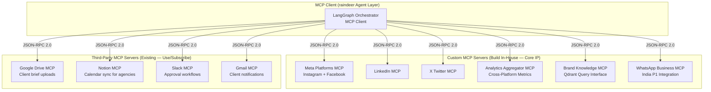

### 9.3 MCP Server Priority Table

| MCP Server | Tools Exposed | Priority | Build/Use |
|------------|-------------|---------|----------|
| **Meta Platforms MCP** | publish_instagram_post, schedule_facebook_post, get_post_insights, get_reel_analytics, get_story_metrics, webhook_subscribe | P0 | Build |
| **LinkedIn MCP** | publish_post, schedule_post, get_analytics, get_follower_demographics, get_company_insights | P0 | Build |
| **X Twitter MCP** | post_tweet, schedule_tweet, get_tweet_analytics, get_trending_topics, get_follower_data | P0 | Build |
| **Analytics Aggregator MCP** | get_cross_platform_metrics, generate_performance_report, get_top_posts, get_best_time_to_post | P0 | Build |
| **Brand Knowledge MCP** | query_brand_context, update_brand_memory, get_top_patterns, log_performance_record | P0 | Build |
| **WhatsApp Business MCP** | send_broadcast, get_community_insights, track_link_clicks | P1 (India) | Build |
| **Google Drive MCP** | list_files, get_file, upload_asset, search_files | P1 | Use existing |
| **Notion MCP** | get_database, create_page, update_page, query_blocks | P1 | Use existing |
| **Slack MCP** | post_message, create_approval_workflow, get_channel_messages | P1 | Use existing |
| **Gmail MCP** | send_email, get_thread, create_draft, search_messages | P1 | Use existing |
| **TikTok MCP** | publish_video, get_analytics, get_trending_sounds | P2 | Build |
| **YouTube MCP** | upload_short, get_analytics, get_trending_topics | P2 | Build |

### 9.4 MCP Tool Definition Best Practice

Research shows poor MCP tool descriptions cause agents to select wrong tools or supply invalid parameters. Every raindeer MCP tool must follow this pattern:

```python
# example: meta_mcp_server.py
from mcp import MCPServer, tool

server = MCPServer(name="meta-platforms-mcp", version="1.0.0")

@server.tool(
    name="publish_instagram_post",
    description="""
    Publishes a finalised post to an Instagram Business or Creator account.

    WHEN TO USE:
    - Only when post.status == 'approved'
    - Only when publish_at is within 5 minutes of current time
    - Only when all image_generation_ids in the post are resolved (status='ready')

    DO NOT USE:
    - For scheduling future posts (use schedule_instagram_post instead)
    - If post contains unresolved visual assets
    - If account has exceeded platform rate limit (check rate_limit_status first)

    RETURNS:
    {
      "post_id": "str",
      "published_url": "str",
      "ig_media_id": "str",
      "status": "published" | "failed",
      "error": "str | null"
    }

    ON FAILURE:
    Returns status='failed' with error detail. DO NOT retry more than once.
    Log failure to audit trail and notify human reviewer.
    """,
    input_schema={
        "type": "object",
        "required": ["tenant_id", "post_id", "caption", "image_url"],
        "properties": {
            "tenant_id": {"type": "string", "description": "Tenant UUID for credential lookup"},
            "post_id": {"type": "string", "description": "Internal post UUID for deduplication"},
            "caption": {"type": "string", "maxLength": 2200},
            "image_url": {"type": "string", "format": "uri"},
            "hashtags": {"type": "array", "items": {"type": "string"}, "maxItems": 30},
            "location_id": {"type": "string", "description": "Optional Instagram location tag ID"},
        }
    }
)
async def publish_instagram_post(tenant_id: str, post_id: str, caption: str, 
                                  image_url: str, hashtags: list = None, 
                                  location_id: str = None) -> dict:
    credentials = await vault.get_tenant_credentials(tenant_id, "instagram")
    return await meta_graph_api.publish_photo(
        access_token=credentials["access_token"],
        ig_user_id=credentials["ig_user_id"],
        image_url=image_url,
        caption=caption,
        idempotency_key=post_id,  # Prevents duplicate publishing
    )
```

### 9.5 MCP Security Implementation

Security research (April 2025) identified prompt injection, data exfiltration via tool chaining, and lookalike tools as key MCP vulnerabilities. raindeer.social must implement:

```yaml
# mcp_security_checklist.yaml

authentication:
  protocol: OAuth 2.1 with DPoP (Demonstrating Proof of Possession)
  token_lifetime: 3600s (1 hour) with refresh rotation
  per_tenant_scoped: true           # Each tenant has isolated credentials
  secrets_storage: Supabase Vault / Doppler  # NEVER in code or env files

authorisation:
  model: RBAC at tool level
  roles:
    - agency_admin: full read + write on all client workspaces
    - client_manager: read + write on own workspace
    - client_viewer: read only
    - agent_publisher: write to platform publish tools only
  policy_engine: Open Policy Agent (OPA)
  least_privilege: enforced per tool scope

input_validation:
  sanitise_all_inputs: true
  content_safety_check: before every publish action
  pii_detection: true
  max_caption_length: enforced at MCP layer

audit_logging:
  every_tool_call_logged: true
  log_fields: [caller_agent, tool_name, inputs_hash, output_hash, tenant_id, timestamp, latency_ms]
  storage: append_only_postgresql (immutable for compliance)
  retention: 2_years

rate_limiting:
  per_tenant_per_tool: true
  circuit_breaker: on_3_consecutive_failures
  backoff: exponential (base=2, max_wait=300s)
```

---

## 10. Tool Calling & External Integrations

### 10.1 Tool Architecture Principles

- **All tools are stateless.** State lives in the LangGraph state object and the database — never inside a tool function.
- **All tools are idempotent.** Publishing the same post twice is prevented via deduplication key (post_id) checked before execution.
- **All tool calls are budgeted.** The Orchestrator tracks token consumption and external API call costs per workflow. Configurable budget limits per pricing tier.
- **Retry logic is standardised.** LangGraph handles retries with exponential backoff — tools do not implement their own retry loops.
- **No hardcoded credentials.** Every API key, secret, and token is loaded from Supabase Vault or Doppler at runtime.

### 10.2 Social Media Publishing APIs

| Platform | API | Auth Method | Rate Limit | Monthly Cost | Priority |
|----------|-----|------------|-----------|-------------|---------|
| Instagram | Meta Graph API v21+ | OAuth 2.0 | 200 calls/hr | $0 (usage-based) | P0 |
| Facebook | Meta Graph API v21+ | OAuth 2.0 | 200 calls/hr | $0 | P0 |
| LinkedIn | LinkedIn Marketing API | OAuth 2.0 | 100/day free, 500 partner | $0 (apply for partner) | P0 |
| X (Twitter) | X API v2 | OAuth 2.0 | 50 posts/day free, 1500 Basic | $100/mo (Basic) | P0 |
| WhatsApp Business | Meta Cloud API | OAuth 2.0 + BSP | Pay per conversation | ~$50–200/mo | P1 (India) |
| TikTok | TikTok for Business API | OAuth 2.0 | Varies | $0 (apply for access) | P2 |
| YouTube | YouTube Data API v3 | OAuth 2.0 | 10,000 units/day | $0 | P2 |

> **X API Risk Mitigation**: X API costs are a business model risk. Design the system to function without X as a fallback, and budget $100/month as a fixed cost in P0.

### 10.3 Image Generation APIs

| Provider | Model | Cost/Image | Best For | Priority |
|----------|-------|-----------|---------|---------|
| Black Forest Labs | Flux.1 Pro | ~$0.055 | Highest quality, photorealistic | P0 |
| OpenAI | DALL-E 3 | $0.04 (1024px) | General brand imagery | P0 Fallback |
| Stability AI | Stable Diffusion 3 | $0.065 | Stylistic control, brand colour accuracy | P1 |
| Ideogram | Ideogram 2.0 | $0.08 | Best text-in-image rendering | P1 |
| Bannerbear API | Template renderer | $0.05–0.15 | Brand-consistent carousel assembly | P1 |

**Recommendation**: Launch with Flux.1 Pro API. At scale (>5K accounts), self-host Flux.1 Dev on RunPod/Modal for 80% cost reduction on visual generation.

### 10.4 Trend & Analytics APIs

| Service | Purpose | Cost | Priority |
|---------|---------|------|---------|
| Google Trends (Pytrends) | Keyword trend monitoring | Free | P0 |
| X API v2 (Basic) | Platform trending topics | $100/mo | P0 |
| Reddit API | Niche community trend scanning | Free (rate-limited) | P0 |
| Perplexity API (sonar-pro) | Deep trend research and context | ~$5–20/mo | P1 |
| BuzzSumo API | Content trend analysis, competitor tracking | $199/mo | P2 |
| Brandwatch | Social listening, sentiment analysis | Custom pricing | P3 |

### 10.5 Observability & Infrastructure APIs

| Service | Purpose | Cost |
|---------|---------|------|
| LangSmith | LangGraph tracing, prompt versioning, evals | $0 (free tier) → $39+/mo |
| Sentry | Application errors, exception tracking | $0 (free tier) |
| PostHog | Product analytics, feature flags, session replay | $0 (free tier) |
| Prometheus + Grafana | Infrastructure metrics | $0 (self-hosted) |
| Uptime Robot / Better Uptime | Uptime monitoring | $0–$20/mo |

---

## 11. Data Layer

### 11.1 Three-Tier Memory Architecture

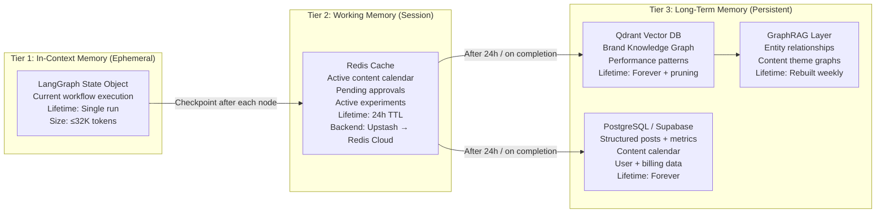

### 11.2 Knowledge Graph Update Pipeline

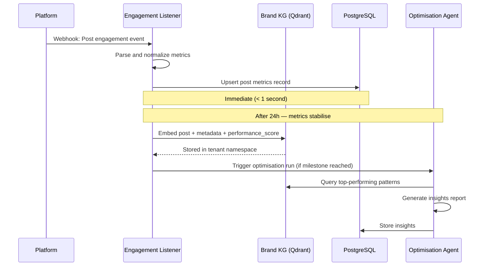

### 11.3 Database Schema — Core Tables

```sql
-- =============================================
-- raindeer.social Core PostgreSQL Schema
-- All IDs are UUID, all timestamps are TIMESTAMPTZ
-- No hardcoded tenant or configuration data
-- =============================================

CREATE TABLE tenants (
    id UUID PRIMARY KEY DEFAULT gen_random_uuid(),
    name TEXT NOT NULL,
    tier TEXT NOT NULL CHECK (tier IN ('starter', 'growth', 'agency', 'agency_pro')),
    parent_tenant_id UUID REFERENCES tenants(id),  -- NULL for root accounts
    billing_email TEXT UNIQUE NOT NULL,
    trial_ends_at TIMESTAMPTZ,
    created_at TIMESTAMPTZ DEFAULT NOW(),
    updated_at TIMESTAMPTZ DEFAULT NOW()
);

CREATE TABLE brand_profiles (
    id UUID PRIMARY KEY DEFAULT gen_random_uuid(),
    tenant_id UUID NOT NULL REFERENCES tenants(id) ON DELETE CASCADE,
    name TEXT NOT NULL,
    website_url TEXT,
    industry_category TEXT,
    voice_attributes JSONB NOT NULL DEFAULT '{}',
    target_audience JSONB NOT NULL DEFAULT '{}',
    content_pillars JSONB NOT NULL DEFAULT '[]',
    platform_configs JSONB NOT NULL DEFAULT '{}',
    onboarding_completed BOOLEAN DEFAULT FALSE,
    qdrant_namespace TEXT UNIQUE NOT NULL,        -- Isolated vector namespace
    created_at TIMESTAMPTZ DEFAULT NOW(),
    updated_at TIMESTAMPTZ DEFAULT NOW()
);

CREATE TABLE content_calendar (
    id UUID PRIMARY KEY DEFAULT gen_random_uuid(),
    tenant_id UUID NOT NULL REFERENCES tenants(id),
    brand_profile_id UUID NOT NULL REFERENCES brand_profiles(id),
    brief TEXT NOT NULL,
    platform TEXT NOT NULL,
    content_type TEXT NOT NULL,
    content_format TEXT NOT NULL,
    scheduled_at TIMESTAMPTZ,
    status TEXT NOT NULL DEFAULT 'planned'
        CHECK (status IN ('planned','drafting','drafted','approved','scheduled','published','failed','skipped')),
    priority_score FLOAT DEFAULT 0.5,
    trend_signal_id UUID,
    created_by TEXT NOT NULL DEFAULT 'system',  -- 'system' or agent name
    created_at TIMESTAMPTZ DEFAULT NOW()
);

CREATE TABLE posts (
    id UUID PRIMARY KEY DEFAULT gen_random_uuid(),
    tenant_id UUID NOT NULL REFERENCES tenants(id),
    calendar_item_id UUID REFERENCES content_calendar(id),
    platform TEXT NOT NULL,
    content TEXT NOT NULL,
    visual_asset_url TEXT,
    visual_prompt TEXT,                          -- Stored for reuse and debugging
    quality_score FLOAT,
    llm_model_used TEXT,                         -- Which model generated this
    tokens_consumed INTEGER,
    cost_usd FLOAT,
    published_at TIMESTAMPTZ,
    platform_post_id TEXT,                       -- Platform's own post ID after publishing
    performance JSONB DEFAULT '{}',              -- {likes, shares, comments, reach, impressions, saves, ctr}
    performance_score FLOAT,                     -- Normalised 0-1 score (computed after 24h)
    experiment_id UUID,
    human_edited BOOLEAN DEFAULT FALSE,
    edit_notes TEXT,
    language TEXT DEFAULT 'en',
    created_at TIMESTAMPTZ DEFAULT NOW()
);

CREATE TABLE experiments (
    id UUID PRIMARY KEY DEFAULT gen_random_uuid(),
    tenant_id UUID NOT NULL REFERENCES tenants(id),
    name TEXT NOT NULL,
    hypothesis TEXT NOT NULL,
    variant_a_post_id UUID REFERENCES posts(id),
    variant_b_post_id UUID REFERENCES posts(id),
    status TEXT DEFAULT 'running' CHECK (status IN ('running','concluded','cancelled')),
    winner_variant TEXT,
    confidence_level FLOAT,
    min_impressions_per_variant INTEGER DEFAULT 200,
    started_at TIMESTAMPTZ DEFAULT NOW(),
    concluded_at TIMESTAMPTZ
);

CREATE TABLE audit_logs (
    id UUID PRIMARY KEY DEFAULT gen_random_uuid(),
    tenant_id UUID NOT NULL,
    agent_name TEXT NOT NULL,
    action TEXT NOT NULL,
    tool_name TEXT,
    input_hash TEXT,
    output_hash TEXT,
    latency_ms INTEGER,
    tokens_consumed INTEGER,
    cost_usd FLOAT,
    success BOOLEAN NOT NULL,
    error_message TEXT,
    logged_at TIMESTAMPTZ DEFAULT NOW()
    -- This table is append-only — never update or delete
);

-- Indexes for common query patterns
CREATE INDEX idx_posts_tenant_platform ON posts(tenant_id, platform);
CREATE INDEX idx_posts_performance_score ON posts(tenant_id, performance_score DESC);
CREATE INDEX idx_calendar_scheduled ON content_calendar(tenant_id, scheduled_at);
CREATE INDEX idx_audit_logs_tenant ON audit_logs(tenant_id, logged_at DESC);
```

---

## 12. Observability, Safety & Guardrails

### 12.1 Observability Stack

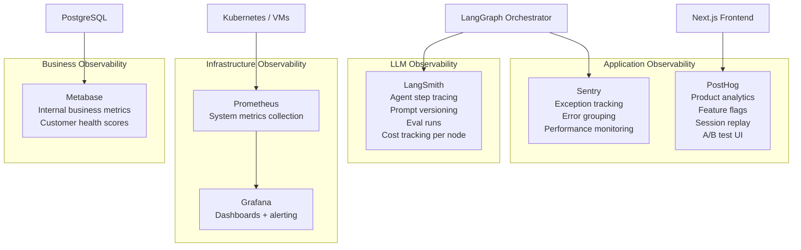

**Key Metrics to Track:**

| Metric | Target | Alert Threshold |
|--------|--------|----------------|
| Per-agent token consumption | Track by agent + tenant | >2x baseline for tenant |
| Content quality score (pre-edit) | >0.80 average | <0.70 triggers review |
| Human approval rate | >75% | <60% = AI miscalibration |
| End-to-end workflow latency | <3 min (calendar gen) | >10 min triggers alert |
| Platform API error rate | <1% | >5% triggers circuit breaker |
| Brand voice drift score | <0.10 semantic drift/week | >0.20 triggers notification |
| Monthly AI cost per account | Monitor by tier | >1.5x projected triggers review |

### 12.2 Content Safety Pipeline

Every post must pass a multi-layer safety pipeline before scheduling:

```python
# safety_pipeline.py — Multi-layer pre-publish content checks

from dataclasses import dataclass
from typing import List
from enum import Enum

class SafetyAction(Enum):
    PASS = "pass"
    FLAG = "flag"
    BLOCK = "block"

@dataclass
class SafetyResult:
    action: SafetyAction
    reason: str = ""
    flag_type: str = ""

class ContentSafetyPipeline:
    """
    Multi-layer safety checks before any content is scheduled.
    All checks run sequentially; any BLOCK halts the pipeline.
    """
    
    def __init__(self, brand_context: dict, config: dict):
        self.brand_context = brand_context
        self.config = config  # Thresholds loaded from env / config
    
    async def run(self, post: dict) -> dict:
        checks = [
            self._check_offensive_content,
            self._check_brand_voice_consistency,
            self._check_factual_claims,
            self._check_legal_risk,
            self._check_platform_policy,
            self._check_spam_signals,
            self._check_pii_exposure,
        ]
        
        flags = []
        for check in checks:
            result = await check(post)
            if result.action == SafetyAction.BLOCK:
                return {
                    "blocked": True,
                    "reason": result.reason,
                    "requires_human_review": True,
                }
            if result.action == SafetyAction.FLAG:
                flags.append(result.flag_type)
        
        return {
            "blocked": False,
            "flags": flags,
            "requires_human_review": len(flags) > 0,
        }

    async def _check_brand_voice_consistency(self, post: dict) -> SafetyResult:
        """Check semantic similarity between post and brand guidelines."""
        similarity = await compute_cosine_similarity(
            post["content"],
            self.brand_context["voice_description"]
        )
        threshold = float(os.environ.get("BRAND_VOICE_THRESHOLD", "0.72"))
        if similarity < threshold:
            return SafetyResult(
                action=SafetyAction.FLAG,
                flag_type="brand_voice_drift",
                reason=f"Brand voice similarity {similarity:.2f} below threshold {threshold}"
            )
        return SafetyResult(action=SafetyAction.PASS)
```

### 12.3 Human-in-the-Loop Review Interface

The review card must show agent reasoning — not just the output. This builds trust and improves the feedback loop:

```
┌─────────────────────────────────────────────────────────────────┐
│ [PLATFORM: Instagram] [TYPE: Educational] [TREND: ↑ AI for SMBs]│
│                                                                   │
│ 📝 CONTENT:                                                       │
│ "3 signs your social media needs AI automation (and what to      │
│  do about each one)..."                                          │
│                                                                   │
│ 🤖 AGENT REASONING:                                              │
│   • Trend match: "AI for small business" trending ↑340% (X/GT)  │
│   • Pattern match: "X signs" hooks → 89th percentile saves       │
│     for this account in educational content                      │
│   • Educational carousels: 2.4x more saves vs text posts        │
│   • Brand voice score: 0.91 ✅ (above 0.80 threshold)           │
│   • Optimal post time: Thursday 6–8PM IST (account data)        │
│                                                                   │
│ 📊 PREDICTED PERFORMANCE: ↑ Above average (top 30%)             │
│                                                                   │
│ 🚩 FLAGS: None                                                    │
│                                                                   │
│ [✅ Approve]  [✏️ Edit]  [🔄 Regenerate with notes]  [❌ Skip]  │
└─────────────────────────────────────────────────────────────────┘
```

---

## 13. Infrastructure & Deployment

### 13.1 Recommended Technology Stack

| Component | Technology | Rationale |
|-----------|-----------|-----------|
| Backend API | FastAPI (Python 3.12+) | Async-native, Pydantic v2 validation, LangGraph ecosystem |
| Frontend | Next.js 15 + TypeScript + Tailwind | App Router, RSC, excellent DX |
| Mobile | React Native (Expo SDK 52) | Code sharing with web, fast iteration |
| Database | Supabase (PostgreSQL 16) | Managed Postgres + Auth + Realtime + Storage + Vault |
| Vector DB | Qdrant Cloud → Self-hosted | Best multi-tenant support, hybrid search |
| Cache / State | Redis (Upstash serverless → Redis Cloud) | LangGraph checkpointing, session state |
| File Storage | Cloudflare R2 | S3-compatible, $0 egress, generous free tier |
| LLM Gateway | LiteLLM | Model routing, cost tracking, fallback, caching |
| Agent Framework | LangGraph + CrewAI | As detailed in Section 8 |
| Task Queue | Celery + Redis | Async background tasks (batch processing) |
| Container | Docker + Kubernetes | Scale-out agent worker pools |
| Cloud | GCP (Mumbai region primary) | Best latency for India, strong Kubernetes support |
| CI/CD | GitHub Actions + Pulumi | Infrastructure as code, reproducible deployments |
| Secrets | Doppler (dev) → Supabase Vault (prod) | Zero hardcoded credentials anywhere |
| Observability | LangSmith + Prometheus/Grafana + Sentry + PostHog | Full-stack visibility |

### 13.2 Scaling Architecture

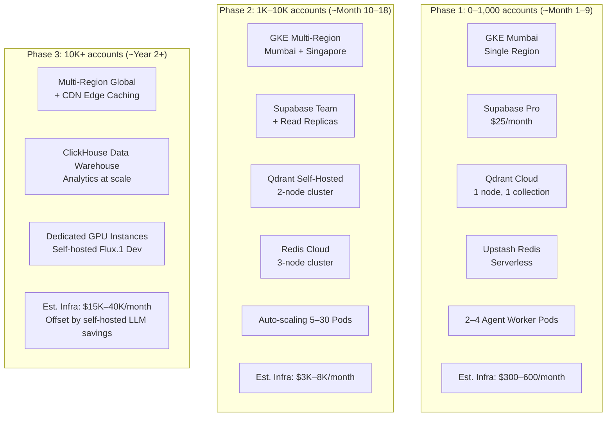

### 13.3 Configuration Management — Zero Hardcoding

```python
# config.py — All values from environment / Vault
# No API keys, secrets, or configuration values in source code

import os
from pydantic_settings import BaseSettings, SettingsConfigDict

class Settings(BaseSettings):
    model_config = SettingsConfigDict(
        env_file=".env",
        env_file_encoding="utf-8",
        extra="forbid",          # Fails loudly if unknown env vars present
    )

    # --- Service URLs ---
    database_url: str
    redis_url: str
    qdrant_url: str
    qdrant_api_key: str
    cloudflare_r2_endpoint: str

    # --- LLM API Keys (loaded at runtime, never logged) ---
    anthropic_api_key: str
    openai_api_key: str
    google_api_key: str
    cohere_api_key: str

    # --- Image Generation ---
    bfl_api_key: str              # Black Forest Labs (Flux.1)
    bannerbear_api_key: str       # Template rendering

    # --- Trend APIs ---
    perplexity_api_key: str
    buzzsumo_api_key: str = ""    # Optional P2 feature

    # --- Observability ---
    langsmith_api_key: str
    langsmith_project: str = "raindeer-production"
    sentry_dsn: str
    posthog_api_key: str

    # --- Agent Configuration ---
    default_model_tier: str = "tier2-standard"
    auto_approve_threshold: float = 0.85
    brand_voice_threshold: float = 0.72
    max_tokens_per_workflow: int = 100_000
    max_experiments_per_account: int = 2
    trend_scan_interval_hours: int = 4

    # --- Feature Flags (also managed via PostHog) ---
    enable_visual_content: bool = True
    enable_trend_intelligence: bool = True
    enable_whatsapp_integration: bool = False   # India P1 — not yet GA

    # Per-tenant social media credentials are NEVER stored here.
    # They are stored in Supabase Vault and retrieved per-request.

settings = Settings()
```

---

## 14. Revised Product Roadmap

### Phase 1 — Social OS Foundation (Months 1–9)

**Goal**: Launch with a production-grade automated content pipeline that agencies and DTC brands love and can't stop using.

**Core Deliverables:**

| Feature | Description | Agent(s) | Tech |
|---------|-------------|---------|------|
| Brand Onboarding Wizard | URL → brand profile in 30 seconds | Brand Intelligence Agent | Claude Sonnet + Qdrant |
| Brand Knowledge Graph Init | Ingest website, past posts, brand docs | Brand Intelligence Agent | Adaptive RAG |
| Multi-Platform Calendar Gen | Instagram, LinkedIn, X — 30-day calendar | Planner Agent | LangGraph |
| AI Content Generation | Text posts, hooks, captions, hashtags | Content Crew (CrewAI) | LiteLLM Router |
| Visual Content Gen v1 | Single image generation per post | Visual Content Agent | Flux.1 Pro API |
| Human Review Interface | Post cards with agent reasoning | UI Layer | Next.js |
| One-Click Publishing | Automated scheduling and posting | Scheduling + MCP Servers | Meta/LinkedIn/X APIs |
| Basic Analytics Dashboard | Engagement tracking per post + platform | Optimisation Agent | PostHog + Metabase |
| Multi-Tenant Architecture | Agency parent + client child accounts | System Design | Supabase Row-Level Security |
| Agency Client Switcher | Dashboard for managing multiple client workspaces | UI Layer | Next.js + Zustand |
| WhatsApp Notifications | Post published / approval needed alerts | Notification Service | WhatsApp Business API |

**Technical Milestones:**
- LangGraph orchestration + LiteLLM router live and processing real posts
- Qdrant Brand Knowledge Graph with Adaptive RAG returning brand context
- Meta, LinkedIn, X MCP servers passing platform API integration tests
- LangSmith tracing configured and monitoring all agent executions
- Supabase Row-Level Security validated for multi-tenant data isolation

### Phase 2 — Growth Intelligence Layer (Months 10–18)

**Goal**: Transform the content pipeline into a self-optimising growth system that gets measurably smarter each month.

**Core Deliverables:**

| Feature | Description |
|---------|-------------|
| Trend Intelligence Agent | Real-time trend scanning every 4 hours, brand-relevant filtering |
| Experiment Agent | Statistical A/B testing for hooks, CTAs, formats |
| Engagement Listener | Platform webhook integration, crisis detection |
| Visual Content Agent v2 | Carousel builder (5–10 slides), Reels script generator |
| Performance Prediction | Predict post performance before publishing (trained on Brand KG) |
| Brand Voice Drift Alerts | Notify when AI outputs semantically drift from brand guidelines |
| Multi-Language Support | Hindi, Tamil, Bengali, Spanish for global expansion |
| Competitor Tracking (Add-on) | Monitor competitor content cadence and performance |
| GraphRAG Layer | Entity relationship mapping across brand content themes |
| Bayesian Time Optimisation | Account-specific optimal posting time learning |

### Phase 3 — Marketing OS Expansion (Months 19–30)

**Goal**: Expand from social execution to full digital marketing orchestration.

**Core Deliverables:**

| Feature | Description |
|---------|-------------|
| Paid Social Ads Integration | Meta Ads + LinkedIn Ads campaign creation and optimisation |
| Email Marketing Integration | Mailchimp / Klaviyo MCP servers — coordinated email + social campaigns |
| SEO Content Agent | Blog post generation optimised for search rankings |
| Campaign Orchestration | Multi-channel campaigns (social + email + ads) coordinated via LangGraph |
| Predictive Growth Engine | AI-driven follower growth strategy recommendations |
| White-Label Offering | Custom domain, branding removal for large agencies |
| API Access Tier | RESTful API for developers and enterprise integrations |
| TikTok + YouTube Shorts | Short-form video content strategy and script generation |

---

## 15. Business Model

### 15.1 Pricing Architecture — Revised

| Tier | India (₹/mo) | Global ($/mo) | Profiles | Posts/mo | Mode | Key Features |
|------|-------------|-------------|---------|---------|------|-------------|
| **Starter** | ₹999 | $19 | 3 | 60 | Review | Brand KG, text posts, basic scheduling |
| **Growth** | ₹2,499 | $49 | 5 | 200 | Review + Auto | + Visual content, trend alerts, analytics |
| **Agency** | ₹6,999 | $129 | 15 | 600 | All modes | + Multi-client, white-label prep, A/B tests |
| **Agency Pro** | ₹17,499 | $349 | 40 | 2,000 | All modes | + API access, Slack approvals, competitor tracking |
| **Enterprise** | Custom | Custom | Unlimited | Unlimited | All modes | + SLA, dedicated support, custom integrations |

### 15.2 Unit Economics — Conservative Estimate

At Growth tier ($49/month, 200 posts/month):

| Cost Item | Monthly Cost |
|-----------|-------------|
| LLM costs (with routing + caching) | ~$4.50 |
| Image generation (100 images × $0.055) | ~$5.50 |
| Infrastructure allocation | ~$2.50 |
| Platform API costs | ~$1.00 |
| Qdrant / Redis per-account | ~$0.50 |
| **Total COGS** | **~$14/month** |
| **Gross Margin** | **~71%** |

At Agency tier ($129/month, 15 profiles, 600 posts/month):

| Cost Item | Monthly Cost |
|-----------|-------------|
| LLM costs (routing + caching + batching) | ~$12 |
| Image generation (300 images) | ~$16.50 |
| Infrastructure allocation | ~$5 |
| Platform API costs | ~$3 |
| Storage and vector DB | ~$1.50 |
| **Total COGS** | **~$38/month** |
| **Gross Margin** | **~70%** |

**Gross margin target**: 70–78% (achievable with model routing + prompt caching + Flux.1 self-hosting at scale).

### 15.3 Monetisation Add-Ons

| Add-On | Price | What It Includes |
|--------|-------|-----------------|
| Trend Intelligence Pack | +$15/mo (₹1,199) | Real-time hourly scanning, instant trend alerts |
| Visual Content Pro | +$25/mo (₹1,999) | Carousel builder, Reel scripts, 500 images/mo |
| Analytics Pro | +$20/mo (₹1,499) | Deep analytics, competitor tracking, benchmarks |
| White-Label | $299/mo setup + $99/mo/domain | Custom branding for agency resale |
| Additional Languages | +$9/mo per language | Hindi, Tamil, Telugu, Bengali, etc. |

### 15.4 Go-to-Market Strategy

**India-First, SEA Second, Global Third:**

1. **Agency Partner Programme** *(Month 1)*: Identify 20 top Indian social media agencies. Offer free Agency tier for 90 days, with commission on client conversions. Agencies become distribution partners.

2. **Founder-Led DTC Seeding** *(Month 1)*: Target 50 Indian DTC brand founders on LinkedIn and Instagram. Personal outreach, 30-day free trial with white-glove onboarding.

3. **Creator Seeding** *(Month 2)*: Give 15 Indian micro-influencers (50K–500K followers) free Growth access in exchange for authentic content about the product. Their social presence runs on raindeer.social — live proof.

4. **Meta Marketing** *(Ongoing)*: raindeer.social's own Instagram, LinkedIn, and X accounts must be entirely managed by the product itself. Every post generated, optimised, and published by the AI — the ultimate meta-marketing demonstration.

5. **Product Hunt Launch** *(Month 3)*: Coordinated launch to 500K+ early adopters and tech-forward founders globally.

6. **SEO Content Engine** *(Month 4)*: Blog targeting "AI social media management India", "Buffer alternative India", "social media automation for agencies" — long-tail keywords with high commercial intent.

---

## 16. Brand & UX Alignment

### 16.1 Progressive Disclosure of AI Complexity

The 10-agent architecture must be invisible to users. The UX must feel like calm intelligence, not a machine room:

```
What users see:                    What's actually happening:
───────────────────────────        ─────────────────────────────────────────────
"Analysing your brand..."          Brand Intelligence Agent queries Qdrant Brand KG
                                   with Adaptive RAG, retrieves voice attributes,
                                   top-performing patterns, and audience profile

"Scanning trends for you..."       Trend Intelligence Agent calls Google Trends API,
                                   X Trends, Reddit — filters by cosine similarity
                                   to brand category, ranks by velocity score

"Building your calendar..."        Planner Agent takes brand context + trend signals
                                   → generates 30 structured content briefs as JSON
                                   → stored in PostgreSQL

"Creating your posts..."           LangGraph executes Content Crew (CrewAI) + Visual
                                   Content Agent in parallel. LiteLLM routes caption
                                   tasks to Claude Sonnet, hashtags to Gemini Flash.
                                   Flux.1 API generates images. Safety pipeline runs.

"Ready for your review →"         Workflow paused at human_review node (interrupt()).
                                   State persisted in Redis checkpoint.
```

### 16.2 The Onboarding Magic Moment

The first 5 minutes must be the most impressive AI experience the user has ever had:

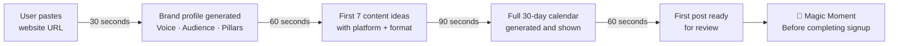

### 16.3 Dashboard Design Philosophy

Aligned with the "calm intelligence" aesthetic — dark mode, electric blue accents, minimal noise:

**Four key dashboard sections:**

1. **Brand Health Score** — A single beautiful metric showing how well recent content aligns with brand guidelines. Changes weekly.
2. **Content Pipeline** — Calm Kanban view: `Trend Detected → Brief → Drafting → Ready → Scheduled → Published`.
3. **Performance Pulse** — Subtle real-time graph showing engagement trajectory. Not cluttered analytics — one signal.
4. **AI Reasoning Feed** — Collapsible panel showing what agents are thinking. Transparent, trust-building.

---

## 17. Build vs. Buy Matrix

| Component | Decision | Rationale |
|-----------|----------|-----------|
| LLM APIs (Claude, Gemini, GPT) | **Buy** | Never build |
| Agent Orchestration (LangGraph) | **Buy** (open-source) | Production-grade, 90K+ GitHub stars |
| Inner Agent Teams (CrewAI) | **Buy** (open-source) | Role-based collaboration, fast iteration |
| LLM Gateway (LiteLLM) | **Buy** (open-source) | Model routing, cost tracking, fallbacks |
| Vector Database (Qdrant) | **Buy** (managed → self-hosted) | Best multi-tenant support |
| RAG Framework (LlamaIndex) | **Buy** (open-source, base utilities) | Retrieval utilities only |
| Auth (Supabase Auth) | **Buy** | JWT, RLS, API keys — don't build auth |
| Image Generation (Flux.1 API) | **Buy** → Self-host at scale | Zero marginal cost at scale with GPU |
| LLM Observability (LangSmith) | **Buy** | LangGraph-native, irreplaceable for debugging |
| Product Analytics (PostHog) | **Buy** | Feature flags + analytics in one |
| Core Social MCP Servers | **Build** | This is core IP — custom publishing logic |
| Brand Knowledge MCP Server | **Build** | Core IP — brand graph query interface |
| Brand Voice Scoring Logic | **Build** | Core IP — custom semantic scoring model |
| Trend Intelligence Filters | **Build** (hybrid) | Combine public APIs with custom brand-relevance scoring |
| Analytics Aggregation | **Build** (thin layer) | Aggregate platform data with custom normalisation |
| Content Safety Pipeline | **Build** | Custom checks + OpenAI Moderation API |
| Template Rendering | **Buy** (Bannerbear API) | Professional brand-consistent visual assembly |

---

## 18. Risk Register

| Risk | Likelihood | Impact | Mitigation Strategy |
|------|-----------|--------|-------------------|
| **X (Twitter) API pricing increases** | High | High | Budget $100/mo X Basic; design system to function without X as graceful degradation |
| **Meta Graph API policy changes** | Medium | Very High | Join Meta Marketing Partners programme; monitor developer blog; abstract Meta calls behind MCP server |
| **LLM cost spikes (Anthropic pricing)** | Low | Medium | LiteLLM router with automatic downgrade to cheaper model; Gemini Flash fallback |
| **Brand voice drift (AI quality degrades)** | Medium | High | Brand Voice Drift score monitoring; weekly semantic similarity checks; RLHF-style feedback loop from human edits |
| **India DPDP Act compliance** | Medium | High | Supabase Mumbai region; per-tenant data isolation; no cross-tenant data leakage; consent management |
| **EU GDPR compliance (for global expansion)** | Medium | High | Supabase EU region option; right-to-erasure pipeline; data processing agreements |
| **Canva AI / Buffer AI copies feature set** | High | Medium | Brand Knowledge Graph depth is the moat — not features. First-mover advantage on brand memory architecture. |
| **Agent loops / infinite retries** | Low | Medium | LangGraph budget limits per workflow; circuit breakers on all external tool calls; max 3 retries with exponential backoff |
| **Prompt injection via user-uploaded brand content** | Medium | High | Input sanitisation at MCP tool layer; never execute user-supplied content as instructions |
| **Social platform rate limiting** | Medium | Medium | Per-tenant publishing queue; exponential backoff; batched scheduling within platform windows |
| **LLM hallucination in brand content** | Medium | Medium | Content safety pipeline; brand voice consistency check; human review defaults for new accounts for first 30 days |
| **Multi-tenant data leakage** | Low | Critical | Supabase Row-Level Security + Qdrant namespace isolation + Vault per-tenant credentials; automated security testing |
| **Key team member departure** | Medium | High | Full documentation; no bus-factor code; open-source frameworks reduce proprietary knowledge dependency |
| **SocialPilot acquisition signal — M&A interest** | Medium | Positive risk | Position for strategic acquisition by 2028; maintain clean architecture and strong unit economics |

---

## 19. Appendix — Full Technology Reference Stack

### 19.1 Complete Technology YAML

```yaml
# tech_stack.yaml — raindeer.social Complete Reference Stack
# Version: 2.0 — May 2026
# IMPORTANT: No hardcoded values. All credentials from Vault/Doppler.

ai_layer:
  llm_gateway:
    tool: litellm
    version: ">=1.40"
    routing_strategy: cost_based_with_fallback
  
  models:
    tier1_fast:
      name: gemini/gemini-2.5-flash
      use_cases: [hashtags, caption_variations, reformatting, short_descriptions]
      estimated_share: 0.60
    tier2_standard:
      name: anthropic/claude-sonnet-4-6
      use_cases: [full_post_drafts, calendar_generation, hook_writing, brand_voice_content]
      estimated_share: 0.30
    tier3_complex:
      name: anthropic/claude-opus-4-6
      use_cases: [strategy_synthesis, brand_analysis, trend_research]
      estimated_share: 0.10
    fallback:
      name: openai/gpt-4.1-mini
      use_cases: [all_tasks_on_primary_failure]
  
  embeddings:
    primary: openai/text-embedding-3-large      # 1536 dimensions, English
    multilingual: cohere/embed-multilingual-v3  # 100+ languages, India regional
    reranker: cohere/rerank-v3
  
  image_generation:
    primary: black-forest-labs/flux-1-pro        # API
    fallback: openai/dall-e-3                    # API
    template_rendering: bannerbear               # Brand-consistent carousels
    self_hosted_target: flux-1-dev               # RunPod/Modal at Phase 3

agent_framework:
  orchestration:
    tool: langgraph
    version: ">=1.0"
    state_backend: redis
    checkpointing: langgraph-checkpoint-redis
    tracing: langsmith
    human_in_loop: interrupt_before_human_review
  
  inner_crews:
    tool: crewai
    version: ">=0.80"
    process: hierarchical    # Manager agent delegates to specialists
    memory: true
  
  memory_tiers:
    in_context: langgraph_state_object    # Ephemeral, single workflow
    working: redis                        # 24h TTL, active workflows
    long_term:
      vector: qdrant                      # Brand Knowledge Graph
      structured: postgresql              # Post records, metrics
      graph: microsoft_graphrag           # Entity relationships

data_layer:
  primary_database:
    tool: supabase                        # PostgreSQL 16+
    features: [auth, realtime, storage, vault, rls]
    region_primary: ap-south1             # Mumbai (India-first)
    region_secondary: ap-southeast1      # Singapore (Phase 2)
  
  vector_database:
    tool: qdrant
    phase1: qdrant_cloud                  # Managed, 1 node
    phase2: qdrant_self_hosted            # 2-node cluster on GKE
    search_type: hybrid                   # dense + sparse BM25
    multi_tenant: namespace_per_tenant
  
  cache_and_state:
    phase1: upstash_redis                 # Serverless
    phase2: redis_cloud                   # 3-node cluster
  
  file_storage: cloudflare_r2            # $0 egress, S3-compatible
  
  analytics_warehouse:
    phase1: postgresql_with_metabase      # Internal reporting
    phase2: clickhouse                    # High-volume analytics at scale

mcp:
  sdk: mcp-python
  version: latest
  transport: http_with_sse               # Streamable HTTP (2025-11-25 spec)
  authentication: oauth_2_1_with_dpop
  
  custom_servers:                        # Build in-house — Core IP
    - name: meta-platforms-mcp
      platforms: [instagram, facebook]
    - name: linkedin-mcp
      platforms: [linkedin]
    - name: x-twitter-mcp
      platforms: [x]
    - name: analytics-aggregator-mcp
      scope: cross_platform_metrics
    - name: brand-knowledge-mcp
      scope: qdrant_query_interface
    - name: whatsapp-business-mcp       # India P1
      scope: community_and_broadcast
  
  third_party_servers:                   # Use existing
    - google-drive-mcp
    - notion-mcp
    - slack-mcp
    - gmail-mcp

backend:
  framework: fastapi
  python_version: ">=3.12"
  async_server: uvicorn
  task_queue: celery
  task_broker: redis
  api_gateway:
    dev: traefik
    prod: kong
  cors: configured_per_environment

frontend:
  web:
    framework: next.js
    version: "15"
    language: typescript
    styling: tailwind_css
    state_management: zustand
    realtime: supabase_realtime
    component_library: shadcn_ui
  mobile:
    framework: react_native
    tooling: expo_sdk_52

infrastructure:
  containerisation: docker
  orchestration: kubernetes
  cloud_primary: gcp                     # Mumbai ap-south1
  cloud_secondary: gcp                   # Singapore ap-southeast1 (Phase 2)
  iac: pulumi
  ci_cd: github_actions
  registry: google_artifact_registry

security:
  authentication: supabase_auth          # JWT + API keys + OAuth
  authorisation: row_level_security + open_policy_agent
  secrets_management:
    dev: doppler
    prod: supabase_vault
  content_safety:
    - custom_brand_voice_check
    - openai_moderation_api
    - pii_detection
  audit_logs: append_only_postgresql
  network:
    api_tls: true
    mcp_mtls: recommended_prod           # Mutual TLS between agent and MCP servers

observability:
  llm_tracing: langsmith
  error_tracking: sentry
  product_analytics: posthog
  infrastructure_metrics: prometheus + grafana
  uptime_monitoring: better_uptime
  internal_reporting: metabase

cost_optimisation:
  llm_routing: litellm_cost_based        # 60-70% savings vs single model
  prompt_caching: enabled                # 40-55% savings on brand context calls
  batch_api: enabled_for_monthly_reports # 50% savings on analytics tasks
  image_gen_self_host: phase3_target     # 80% savings at >5K accounts
```

### 19.2 Open-Source Repository References

| Project | Repository | Version | Purpose |
|---------|-----------|---------|---------|
| LangGraph | github.com/langchain-ai/langgraph | v1.x | Agent orchestration |
| LiteLLM | github.com/BerriAI/litellm | latest | LLM gateway and routing |
| CrewAI | github.com/crewAIInc/crewAI | v0.8x | Role-based agent crews |
| LlamaIndex | github.com/run-llama/llama_index | v0.1x | RAG retrieval utilities |
| Qdrant | github.com/qdrant/qdrant | latest | Vector database |
| MCP Python SDK | github.com/modelcontextprotocol/python-sdk | latest | MCP server building |
| Microsoft GraphRAG | github.com/microsoft/graphrag | latest | Knowledge graph RAG |
| RAGAS | github.com/explodinggradients/ragas | latest | RAG pipeline evaluation |
| LangSmith | smith.langchain.com | SaaS | LLM observability |
| Pydantic Settings | github.com/pydantic/pydantic-settings | v2.x | Configuration management |
| FastAPI | github.com/tiangolo/fastapi | latest | Backend API framework |
| Celery | github.com/celery/celery | v5.x | Async task queue |

### 19.3 Key API Documentation References

- Anthropic Claude API: docs.anthropic.com (Prompt Caching, Batch API, Tool Use)
- Google Gemini API: ai.google.dev/gemini-api
- LiteLLM Router: docs.litellm.ai/docs/routing
- LangGraph: langchain-ai.github.io/langgraph
- Qdrant: qdrant.tech/documentation
- MCP Specification: modelcontextprotocol.io/specification/2025-11-25
- Meta Graph API: developers.facebook.com/docs/graph-api
- LinkedIn Marketing API: learn.microsoft.com/en-us/linkedin/marketing
- X API v2: developer.twitter.com/en/docs/x-api
- Flux.1 Pro API: api.bfl.ml
- Supabase: supabase.com/docs

---

## Summary — The Architectural Bets That Matter

| Decision | Why It Matters |
|----------|---------------|
| **LangGraph over custom orchestration** | Production-grade state persistence, audit trails, and native HITL in one framework |
| **Adaptive RAG over static prompts** | Brand memory that grows — the compounding moat no competitor can copy quickly |
| **LiteLLM cost-based routing** | 60-70% LLM cost reduction makes the unit economics viable at Indian price points |
| **MCP for all integrations** | Future-proof — adding a new platform means writing one MCP server, not one custom integration per agent |
| **CrewAI inside LangGraph** | Best of both: LangGraph's production reliability + CrewAI's intuitive role-based content collaboration |
| **Multi-tenant from Day 1** | Agency segment is P0 — retrofitting multi-tenancy is 10x more expensive than building it first |
| **Flux.1 → self-hosted at scale** | Image generation cost reduction from $0.055/image → ~$0.005/image at >5K accounts |
| **India-first with multilingual support** | The fastest-growing SMM market globally, with 90% of new internet users preferring regional languages |

---

*Document Version: 2.0 — May 2026
*Classification: Internal — Product, Engineering & Investor Use*
*Next review: August 2026*

---

> **One-line north star:**
> Build the Brand Knowledge Graph deep enough and the agent mesh smart enough that raindeer.social becomes the cognitive infrastructure of every brand's social identity — genuinely irreplaceable, not just a better scheduler.
